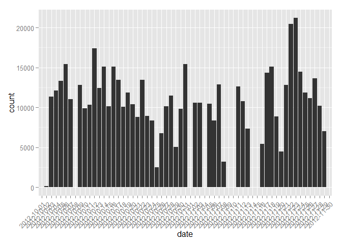
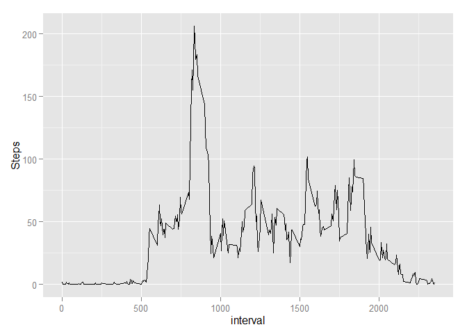
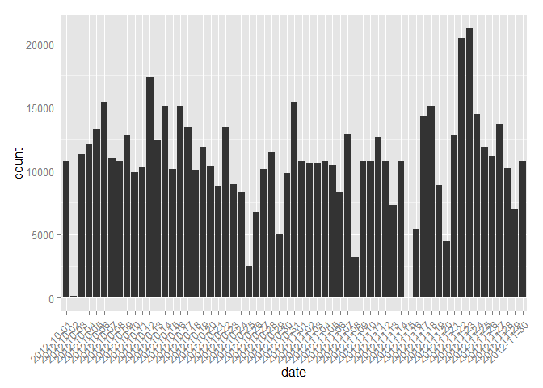
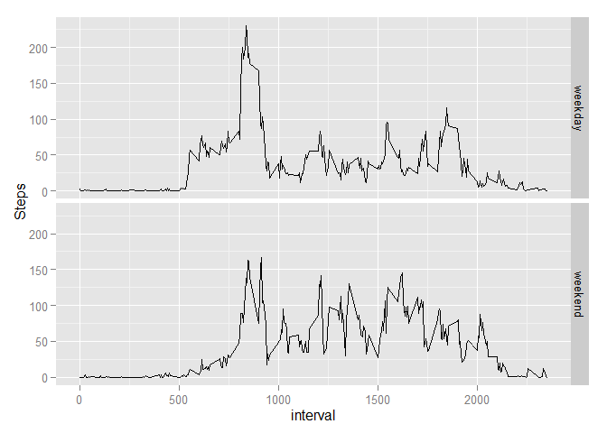

# Reproducible Research: Peer Assessment 1
## Loading relevant packages

```r
library(ggplot2)
library(dplyr)
```

```
## 
## Attaching package: 'dplyr'
```

```
## The following objects are masked from 'package:stats':
## 
##     filter, lag
```

```
## The following objects are masked from 'package:base':
## 
##     intersect, setdiff, setequal, union
```
## Loading and preprocessing the data

```r
unzip ("./activity.zip",unzip="unzip")
activity_data<-read.csv("./activity.csv")
```

## What is mean total number of steps taken per day?
*Make a histogram of the total number of steps taken each day*

```r
p <- ggplot(data = activity_data, aes(x=date))+
        geom_histogram(aes(weights=steps))+
        theme(axis.text.x = element_text(angle = 45, vjust = 1, hjust=1)) 
p
```



*Calculate and report the mean and median total number of steps taken
per day*

```r
activity_data %>%  group_by(date) %>% summarize(Mean=mean(steps,na.rm=TRUE), Median=median(steps,na.rm=TRUE))
```

```
## Source: local data frame [61 x 3]
## 
##          date     Mean Median
## 1  2012-10-01      NaN     NA
## 2  2012-10-02  0.43750      0
## 3  2012-10-03 39.41667      0
## 4  2012-10-04 42.06944      0
## 5  2012-10-05 46.15972      0
## 6  2012-10-06 53.54167      0
## 7  2012-10-07 38.24653      0
## 8  2012-10-08      NaN     NA
## 9  2012-10-09 44.48264      0
## 10 2012-10-10 34.37500      0
## ..        ...      ...    ...
```


## What is the average daily activity pattern?

```r
daily_pattern<-activity_data %>% group_by(interval) %>% summarize(Steps=mean(steps,na.rm=TRUE))
```

*Make a time series plot (i.e. type = "l") of the 5-minute interval (x-axis)
and the average number of steps taken, averaged across all days (y-axis)*

```r
p <- ggplot(data=daily_pattern, aes(x=interval,y=Steps)) +
geom_line()
p
```



*Which 5-minute interval, on average across all the days in the dataset,
contains the maximum number of steps?*

```r
daily_pattern$interval[which(daily_pattern$Steps==max(daily_pattern$Steps))]
```

```
## [1] 835
```

## Imputing missing values
*Calculate and report the total number of missing values in the dataset
(i.e. the total number of rows with NAs)*

```r
length(which(is.na(activity_data$steps),arr.ind=TRUE))
```

```
## [1] 2304
```

*Devise a strategy for filling in all of the missing values in the dataset. Missing
values will be replaced with the mean for that 5-minute interval in order to 
create a new dataset that is equal to the original dataset but with the missing 
data filled in.*

```r
missing<-activity_data[which(is.na(activity_data$steps),arr.ind=TRUE),]
filling_in<-left_join(missing, daily_pattern)
```

```
## Joining by: "interval"
```

```r
complete_activities<-activity_data[]
complete_activities$steps<-replace(complete_activities$steps,is.na(complete_activities$steps),filling_in$Steps[which(filling_in$interval==complete_activities$interval)])
```

```
## Warning in filling_in$interval == complete_activities$interval: longer
## object length is not a multiple of shorter object length
```

```
## Warning in replace(complete_activities$steps, is.na(complete_activities
## $steps), : number of items to replace is not a multiple of replacement
## length
```

*Make a histogram of the total number of steps taken each day *

```r
p <- ggplot(data = complete_activities , aes(x=date))+
        geom_histogram(aes(weights=steps))+
        theme(axis.text.x = element_text(angle = 45, vjust = 1, hjust=1))
p
```



*Calculate and report the mean and median total number of steps taken per day. *

```r
complete_activities %>%  group_by(date) %>% summarize(Mean=mean(steps,na.rm=TRUE), Median=median(steps,na.rm=TRUE))
```

```
## Source: local data frame [61 x 3]
## 
##          date     Mean   Median
## 1  2012-10-01 37.38260 34.11321
## 2  2012-10-02  0.43750  0.00000
## 3  2012-10-03 39.41667  0.00000
## 4  2012-10-04 42.06944  0.00000
## 5  2012-10-05 46.15972  0.00000
## 6  2012-10-06 53.54167  0.00000
## 7  2012-10-07 38.24653  0.00000
## 8  2012-10-08 37.38260 34.11321
## 9  2012-10-09 44.48264  0.00000
## 10 2012-10-10 34.37500  0.00000
## ..        ...      ...      ...
```

*Do these values differ from the estimates from the first part of the assignment?
What is the impact of imputing missing data on the estimates of the total
daily number of steps?*

Yes, they do differ. The imputed values are positive, since they are means of activity over several days. If there has been activity during this interval on any day, we assume that there was activity on the day with missing data. Many of the empirical data points are actually 0, however, so this results in a notable increase in total, mean, and median.

## Are there differences in activity patterns between weekdays and weekends?

*Create a new factor variable in the dataset with two levels – “weekday”
and “weekend” indicating whether a given date is a weekday or weekend
day.*

```r
complete_activities$day=weekdays(as.Date(complete_activities$date)) %in% c('Sunday','Saturday')
complete_activities$day<-as.factor(ifelse(complete_activities$day,'weekend','weekday'))
```

*Make a panel plot containing a time series plot (i.e. type = "l") of the
5-minute interval (x-axis) and the average number of steps taken, averaged
across all weekday days or weekend days (y-axis). *


```r
DayMeans<-complete_activities %>% group_by(day,interval) %>% summarize(Steps=mean(steps,na.rm=TRUE))
p <- ggplot(data = DayMeans, aes(x=interval,y=Steps)) +
        geom_line()+
        facet_grid(day ~ .)
p
```


